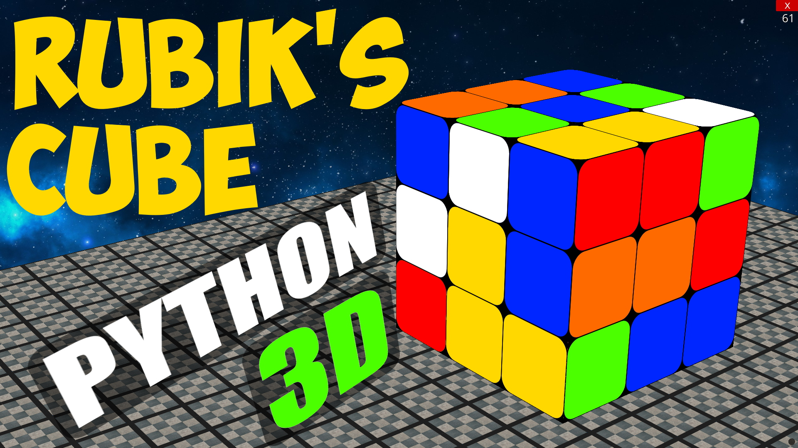

# Rubiks-Cube-3D
Rubik's Cube with Python and 3D Engine - UrsinaEngine

Controls:
Change View and Interaction Modes - Middle Mouse Button

Rotate left, right, back, face - Left mouse button

Rotate top, bottom - Right mouse button

Moving the camera in view mode - holding down the right mouse button

